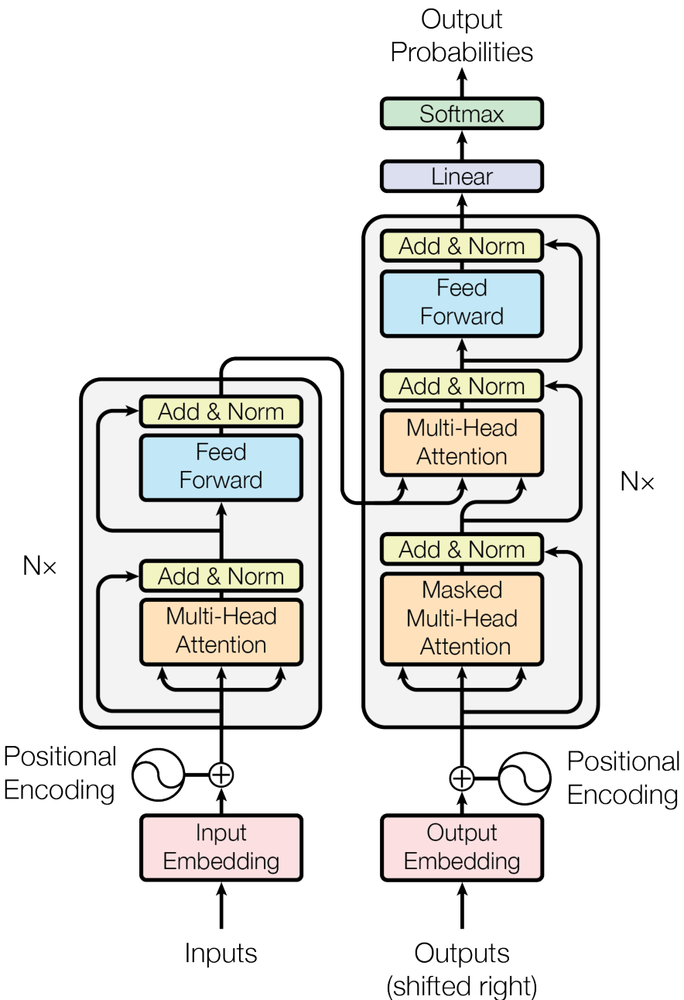
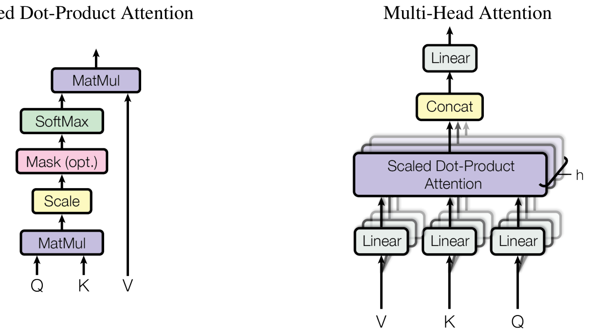
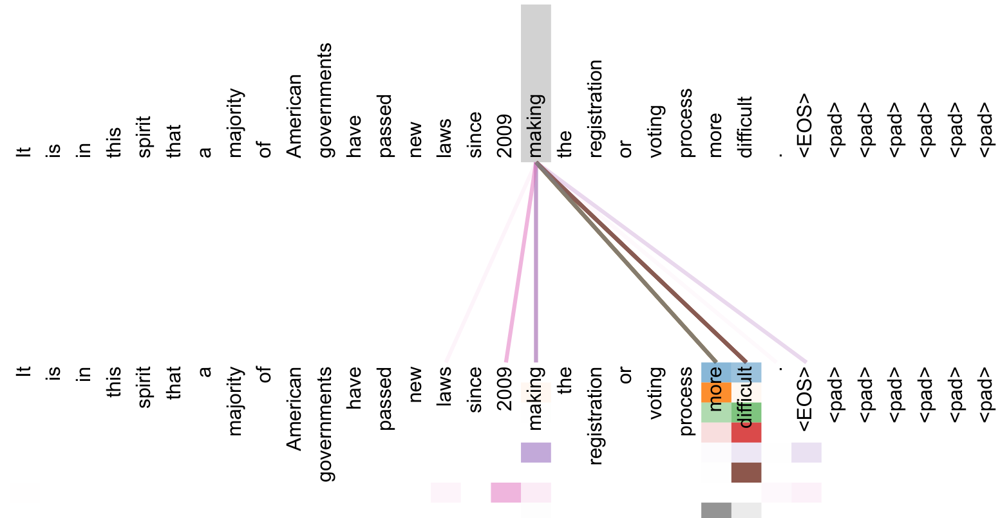
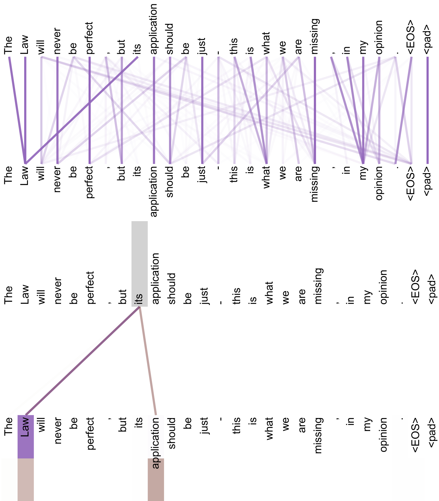
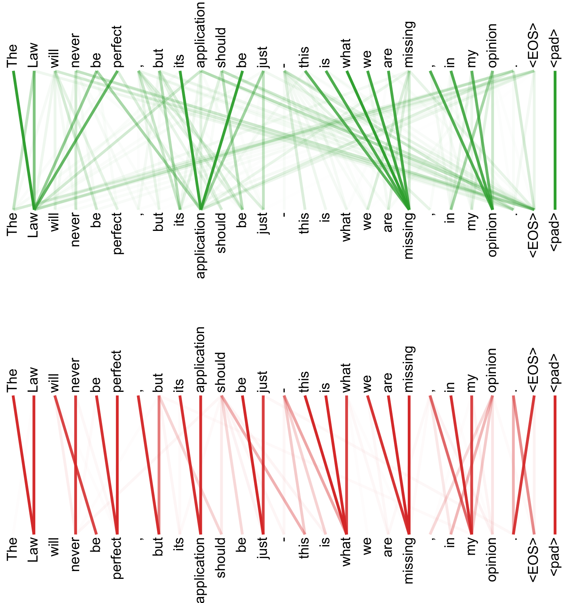

# 注意力就是你所需要的一切

## 标题与元数据

- 原文标题: Attention Is All You Need
- arXiv ID: 1706.03762v7
- 作者: Ashish Vaswani, Noam Shazeer, Niki Parmar, Jakob Uszkoreit, Llion Jones, Aidan N. Gomez, Lukasz Kaiser, Illia Polosukhin
- 发布时间: 2017-06-12T17:57:34Z
- 更新时间: 2023-08-02T00:41:18Z
- 分类: cs.CL, cs.LG
- 原文页面: http://arxiv.org/abs/1706.03762v7
- PDF: https://arxiv.org/pdf/1706.03762v7

## 翻译说明

本文中文稿基于 `GLM-OCR` 结果整理翻译，并按“完整内容优先”重新组织。当前版本尽量保持与英文 OCR 原文的章节顺序一致，覆盖：

- 摘要
- 引言
- 背景
- 模型结构
- 注意力机制
- 位置编码
- 为什么使用自注意力
- 训练设置
- 结果
- 结论
- 附录图示说明
- 参考文献

公式、超参数、表格数字、模型名、数据集名与引用编号尽量保留原文写法，方便和英文 OCR 原文逐段对照。

## 按章节翻译后的正文

### 摘要

主流的序列转导模型通常基于复杂的循环神经网络或卷积神经网络，并采用编码器-解码器结构。表现最好的模型通常还会通过注意力机制把编码器和解码器连接起来。本文提出了一种全新的、更加简洁的网络结构 `Transformer`，它完全建立在注意力机制之上，彻底去除了递归和卷积。

在两个机器翻译任务上的实验表明，Transformer 在质量上更优，同时更容易并行化，训练所需时间也显著减少。作者的模型在 `WMT 2014 English-to-German` 任务上取得了 `28.4 BLEU`，比当时已有最佳结果（包括集成模型）还高出 `2 BLEU` 以上；在 `WMT 2014 English-to-French` 任务上，单模型取得了 `41.8 BLEU` 的新 SOTA，而且训练成本只占先前最好模型的一小部分。作者还展示了 Transformer 在英语成分句法分析任务上的良好泛化能力。

### 1. 引言

循环神经网络，尤其是 `LSTM` 和 `GRU`，已经牢固确立了自己在语言建模和机器翻译等序列建模与转导问题中的主流地位。随后也有大量工作持续推动循环语言模型与编码器-解码器架构的性能上限。

循环模型通常沿着输入和输出序列的符号位置展开计算。它们把位置与时间步对齐，依次生成隐藏状态 `h_t`，其中每个状态依赖于前一个隐藏状态 `h_{t-1}`` 以及当前位置输入。这种天然的串行性质，使得单个训练样本内部无法并行处理；当序列较长时，这一问题会变得非常严重，因为显存限制会压缩 batch 大小。尽管已有工作通过分解技巧或条件计算显著提升了计算效率，并在部分情况下提升了性能，但“顺序计算”这一根本约束始终存在。

注意力机制已经成为许多高性能序列建模和转导模型的核心组成部分，因为它允许模型在不受距离影响的情况下建模依赖关系。不过，除了极少数工作之外，这类注意力机制通常仍然与循环网络配合使用。

本文提出的 `Transformer` 则完全摒弃循环，转而完全依赖注意力机制来建模输入与输出之间的全局依赖。Transformer 能实现更高程度的并行化，并且在仅使用 `8` 张 `P100 GPU` 训练约 `12` 小时后，就达到了新的翻译质量 SOTA。

### 2. 背景

减少顺序计算这一目标，同样也是 `Extended Neural GPU`、`ByteNet` 和 `ConvS2S` 等模型的出发点。这些模型使用卷积神经网络作为基本构件，为输入和输出的所有位置并行计算隐藏表示。

不过，在这类模型中，把任意两个输入或输出位置联系起来所需的操作数量，会随着它们之间的距离而增长：在 `ConvS2S` 中是线性增长，在 `ByteNet` 中是对数增长。这使得它们更难学习远距离依赖。Transformer 则把这种依赖路径压缩到常数级，虽然代价是注意力加权平均会降低一定的有效分辨率，而这一问题可通过 `Multi-Head Attention` 缓解。

自注意力，也称 `intra-attention`，是一种在同一序列内部不同位置之间建立关系、从而计算序列表征的机制。它已经成功应用于阅读理解、抽象摘要、文本蕴含和通用句子表示学习等任务。

基于端到端记忆网络的模型，则使用循环式注意力机制，而不是与序列位置对齐的递归，在简单问答和语言建模任务上也有良好表现。

作者指出，据他们所知，Transformer 是第一个在输入和输出表示上都完全依赖自注意力、而不使用与序列对齐的 `RNN` 或卷积的序列转导模型。后文将详细描述 Transformer，并讨论它相较于此前模型的优势。

### 3. 模型结构

大多数强有力的序列转导模型都采用编码器-解码器结构。编码器把输入序列 `(x1, ..., xn)` 映射成连续表示序列 `z = (z1, ..., zn)`；解码器在此基础上逐个生成输出序列 `(y1, ..., ym)`。在每一步中，模型都是自回归的，也就是会把之前生成的 token 作为后续预测的额外输入。

Transformer 继承了这一总体范式，但在编码器和解码器内部使用堆叠的自注意力层与逐位置前馈层，而不再使用循环结构。

### 图 1

图 1 展示了 Transformer 的总体架构：左侧是编码器堆栈，右侧是解码器堆栈，二者都由自注意力层和逐位置全连接层组成。

#### 3.1 编码器与解码器堆叠

编码器由 `N = 6` 个完全相同的层堆叠而成。每层都包含两个子层：

- 多头自注意力机制
- 逐位置全连接前馈网络

作者在每个子层外都加入残差连接，并在其后施加 `LayerNorm`。也就是说，每个子层的输出形式为：

`LayerNorm(x + Sublayer(x))`

为了支持这种残差结构，模型中的所有子层以及嵌入层都输出维度为 `d_model = 512` 的表示。

解码器同样由 `N = 6` 个相同层堆叠而成。除了每个编码器层中的两个子层之外，解码器层还多出第三个子层，用来对编码器输出执行多头注意力。和编码器一样，解码器中每个子层周围也都有残差连接和层归一化。

此外，解码器中的自注意力还会被修改，以防止当前位置看到后续位置。这个 mask 机制再加上“输出嵌入整体右移一位”的处理，保证了位置 `i` 的预测只能依赖于 `i` 之前已经已知的输出。

#### 3.2 注意力

注意力函数可以被描述为：给定一个 `query` 和一组 `key-value` 对，输出一个向量。这个输出是各个 `value` 的加权和，而权重由 `query` 和对应 `key` 的匹配函数决定。

### 图 2

图 2 左侧是 `Scaled Dot-Product Attention`，右侧是由多个注意力头并行组成的 `Multi-Head Attention`。

#### 3.2.1 缩放点积注意力

作者将他们使用的注意力形式称为 `Scaled Dot-Product Attention`。输入包括：

- `queries`
- `keys`
- `values`

其中 `queries` 和 `keys` 的维度为 `d_k`，`values` 的维度为 `d_v`。具体做法是先计算 `query` 与所有 `key` 的点积，再除以 `sqrt(d_k)`，然后通过 `softmax` 获得权重，最后对 `values` 做加权求和。

在实现上，作者会把一批查询打包成矩阵 `Q`，把 `keys` 和 `values` 分别打包成矩阵 `K` 与 `V`，于是输出矩阵为：

`Attention(Q, K, V) = softmax(QK^T / sqrt(d_k)) V`

文中提到，最常见的两种注意力是：

- 加性注意力 `additive attention`
- 点积注意力 `dot-product attention`

两者在理论复杂度上相近，但点积注意力在实践中更快、也更省空间，因为可以直接利用高效的矩阵乘法实现。对于较大的 `d_k`，点积结果会变大，从而使 `softmax` 落入梯度极小的区域，因此作者引入 `1 / sqrt(d_k)` 的缩放项来缓解这一问题。

#### 3.2.2 多头注意力

作者并没有在 `d_model` 维空间里只做一次注意力，而是把 `queries`、`keys`、`values` 分别通过不同的线性投影映射到多个低维子空间，然后在这些子空间里并行执行注意力操作，得到多个 `d_v` 维输出，再把这些输出拼接起来并做一次线性投影。这就是 `Multi-Head Attention`。

它的核心公式是：

- `MultiHead(Q, K, V) = Concat(head_1, ..., head_h) W^O`
- `head_i = Attention(QW_i^Q, KW_i^K, VW_i^V)`

其中这些线性投影矩阵分别是：

- `W_i^Q ∈ R^{d_model × d_k}`
- `W_i^K ∈ R^{d_model × d_k}`
- `W_i^V ∈ R^{d_model × d_v}`
- `W^O ∈ R^{hd_v × d_model}`

在本文实验中，作者使用了：

- `h = 8` 个并行注意力头
- `d_k = d_v = d_model / h = 64`

由于每个头的维度被缩小，总计算成本与完整维度单头注意力相近。多头注意力的价值在于：模型可以在不同表示子空间、不同位置上同时关注不同类型的信息；如果只有单头，很多信息会被平均掉。

#### 3.2.3 本文模型中注意力的三种用法

Transformer 中的多头注意力有三种使用方式：

1. `encoder-decoder attention`
   查询来自前一层解码器，`key/value` 来自编码器输出。这使得解码器的每个位置都能访问输入序列的所有位置，作用类似传统序列到序列模型中的编码器-解码器注意力。
2. 编码器自注意力
   编码器中的 `query`、`key`、`value` 全部来自前一层编码器输出，因此编码器中的每个位置都能看到前一层的所有位置。
3. 解码器自注意力
   解码器中的每个位置只能看到自己以及之前的位置。为了维持自回归属性，作者在缩放点积注意力内部把对应非法连接的位置 mask 掉，把它们在 `softmax` 输入中设成 `-∞`。

#### 3.3 逐位置前馈网络

除了注意力子层，编码器和解码器的每一层还包含一个逐位置的全连接前馈网络，它会对每个位置独立地执行相同变换。其形式为：

`FFN(x) = max(0, xW1 + b1) W2 + b2`

这可以看作两个 `kernel size = 1` 的卷积。输入与输出维度都是 `d_model = 512`，中间隐藏层维度为 `d_ff = 2048`。

#### 3.4 嵌入与 Softmax

和其他序列转导模型一样，作者使用学习得到的嵌入把输入 token 和输出 token 映射到 `d_model` 维向量，并使用线性层与 `softmax` 生成下一个 token 的概率。

模型还共享了两个嵌入层和 pre-softmax 线性变换的权重矩阵，类似于已有工作 [30]。在嵌入层，作者会把这些权重乘以 `sqrt(d_model)`。

#### 表 1

`Table 1` 比较了不同层类型的：

- 每层复杂度
- 最少顺序操作数
- 最大路径长度

结果如下：

| Layer Type | Complexity per Layer | Sequential Operations | Maximum Path Length |
| --- | --- | --- | --- |
| Self-Attention | `O(n^2 · d)` | `O(1)` | `O(1)` |
| Recurrent | `O(n · d^2)` | `O(n)` | `O(n)` |
| Convolutional | `O(k · n · d^2)` | `O(1)` | `O(log_k(n))` |
| Self-Attention (restricted) | `O(r · n · d)` | `O(1)` | `O(n/r)` |

#### 3.5 位置编码

由于模型中既没有递归也没有卷积，因此必须显式地向序列表示中注入位置信息，让模型能够感知 token 顺序。作者把位置编码加到编码器和解码器最底层的输入嵌入上。位置编码的维度与嵌入维度相同，都是 `d_model`，这样两者可以直接相加。

本文使用的是不同频率的正弦和余弦函数：

- `PE(pos, 2i) = sin(pos / 10000^(2i/d_model))`
- `PE(pos, 2i+1) = cos(pos / 10000^(2i/d_model))`

其中 `pos` 表示位置，`i` 表示维度。不同维度对应不同频率的正弦波，其波长从 `2π` 到 `10000 · 2π` 呈几何级数变化。

作者选择这种编码方式，是因为他们猜测它能让模型更容易学会“相对位置关注”，因为对于固定偏移 `k`，`PE_{pos+k}` 可以表示为 `PE_pos` 的线性函数。

他们也尝试过可学习的位置嵌入，发现两者结果几乎一致（见 `Table 3` 中的 `(E)` 行）。最终选择正弦编码，是因为它可能更容易外推到训练时没见过的更长序列。

### 4. 为什么使用自注意力

这一节作者把自注意力层与循环层、卷积层进行比较，比较维度包括：

- 每层总计算复杂度
- 可并行化程度
- 长距离依赖之间的路径长度

学习长距离依赖是许多序列转导任务中的核心难题。影响其难易程度的重要因素之一，就是网络中任意两个位置之间前向和反向信号需要经过的路径长度。路径越短，学习长距离依赖越容易。

正如 `Table 1` 所示，自注意力层只需要常数级顺序操作，而循环层需要 `O(n)` 级顺序操作。从计算复杂度角度看，当序列长度 `n` 小于表示维度 `d` 时，自注意力通常比循环层更快，而在机器翻译使用的 `word-piece` 和 `byte-pair` 表示中，这种情况非常常见。

对于非常长的序列，作者提出未来可以把自注意力限制在局部邻域 `r` 内，这会把最大路径长度提高到 `O(n/r)`，但依旧有希望在效率与建模能力之间取得较好折中。

另一方面，卷积层若想连接任意输入输出位置，需要堆叠多层卷积：对于连续卷积核是 `O(n/k)` 层，对于空洞卷积是 `O(log_k(n))` 层。这会增加网络中最长路径。卷积层通常也比循环层更昂贵，代价大约多一个 `k` 倍。虽然可分离卷积能把复杂度降到 `O(k · n · d + n · d^2)`，但即便 `k = n`，其复杂度也只是与“一个自注意力层 + 一个逐位置前馈层”的组合相当，而这正是 Transformer 采用的基本单元。

作者还指出，自注意力可能带来更高的可解释性。文末附录中的可视化显示，不同注意力头学到了不同职责，其中一些头明显表现出与句法和语义结构相关的行为。

### 5. 训练

#### 5.1 训练数据与 batching

作者在标准的 `WMT 2014 English-German` 数据集上训练，数据集规模约为 `4.5M` 句对。句子使用 `byte-pair encoding` 编码，共享源语言和目标语言词表，大小约 `37000` 个 token。

对于 `English-French`，作者使用了规模更大的 `WMT 2014 English-French` 数据集，共 `36M` 句，并使用 `32000` 大小的 `word-piece` 词表。

训练时，句对会按近似序列长度聚合成 batch。每个训练 batch 大约包含：

- `25000` 个源语言 token
- `25000` 个目标语言 token

#### 5.2 硬件与训练日程

作者在一台拥有 `8 NVIDIA P100 GPU` 的机器上训练模型。

对于 base 模型，在文中给定超参数下：

- 每个训练 step 约 `0.4` 秒
- 总训练步数 `100,000`
- 总耗时约 `12` 小时

对于 big 模型：

- 每个训练 step 约 `1.0` 秒
- 总训练步数 `300,000`
- 总耗时约 `3.5` 天

#### 5.3 优化器

作者使用 `Adam` 优化器，参数设置为：

- `β1 = 0.9`
- `β2 = 0.98`
- `ϵ = 10^-9`

学习率会在训练过程中动态变化，公式为：

`lrate = d_model^-0.5 · min(step_num^-0.5, step_num · warmup_steps^-1.5)`

这意味着学习率在前 `warmup_steps` 内线性增大，之后按步数平方根倒数衰减。文中使用 `warmup_steps = 4000`。

#### 5.4 正则化

作者在训练中使用了三种正则化，这里 OCR 原文明确保留下来的包括：

- `Residual Dropout`
  对每个子层输出在与残差输入相加并归一化前做 dropout；同时也对编码器和解码器中的“嵌入 + 位置编码”之和做 dropout。base 模型中使用 `P_drop = 0.1`。
- `Label Smoothing`
  训练时使用 `ϵ_ls = 0.1`。这种做法会让模型变得更“不确定”，从而损害困惑度，但能提升准确率和 `BLEU` 分数。

#### 表 2

`Table 2` 比较了 Transformer 与当时 SOTA 模型在 `newstest2014` 上的 BLEU 和训练成本。

| Model | EN-DE BLEU | EN-FR BLEU | EN-DE Training Cost | EN-FR Training Cost |
| --- | --- | --- | --- | --- |
| ByteNet [18] | 23.75 |  |  |  |
| Deep-Att + PosUnk [39] |  | 39.2 |  | `1.0 × 10^20` |
| GNMT + RL [38] | 24.6 | 39.92 | `2.3 × 10^19` | `1.4 × 10^20` |
| ConvS2S [9] | 25.16 | 40.46 | `9.6 × 10^18` | `1.5 × 10^20` |
| MoE [32] | 26.03 | 40.56 | `2.0 × 10^19` | `1.2 × 10^20` |
| Deep-Att + PosUnk Ensemble [39] |  | 40.4 |  | `8.0 × 10^20` |
| GNMT + RL Ensemble [38] | 26.30 | 41.16 | `1.8 × 10^20` | `1.1 × 10^21` |
| ConvS2S Ensemble [9] | 26.36 | 41.29 | `7.7 × 10^19` | `1.2 × 10^21` |
| Transformer (base) | 27.3 | 38.1 | colspan `3.3 × 10^18` | colspan `3.3 × 10^18` |
| Transformer (big) | 28.4 | 41.8 | colspan `2.3 × 10^19` | colspan `2.3 × 10^19` |

### 6. 结果

#### 6.1 机器翻译

在 `WMT 2014 English-to-German` 任务上，big Transformer 模型（即 `Table 2` 中的 `Transformer (big)`）比此前所有已报道模型（包括集成模型）高出 `2.0 BLEU` 以上，取得了 `28.4 BLEU` 的新 SOTA。这个模型的配置列在 `Table 3` 最后一行。训练耗时约 `3.5` 天，硬件为 `8 P100 GPU`。甚至作者的 base 模型，也已经超过此前所有已发表模型与集成模型，而训练成本只是竞争模型的一小部分。

在 `WMT 2014 English-to-French` 任务上，big 模型取得了 `41.0` 左右的 BLEU，并优于当时所有已发表单模型，而且训练成本不到先前 SOTA 的四分之一。针对 `English-French` 训练时，作者把 big 模型的 dropout 设置成 `P_drop = 0.1`，而不是 `0.3`。

对于 base 模型，作者使用最近 `5` 个 checkpoint 的平均结果，每个 checkpoint 间隔 `10` 分钟；对于 big 模型，则对最后 `20` 个 checkpoint 做平均。

解码时采用：

- beam size = `4`
- length penalty `α = 0.6`
- 最大输出长度 = 输入长度 + `50`

这些超参数是通过开发集实验确定的。作者还通过训练时间、GPU 数量和每张 GPU 的持续单精度 FLOPS 来估算训练总浮点运算量。

#### 6.2 模型变体

为了评估 Transformer 各个组成部分的重要性，作者对 base 模型做了多种改动，并在 `English-to-German newstest2013` 开发集上测试性能变化。结果汇总在 `Table 3` 中。

#### 表 3

`Table 3` 包含以下几组消融：

- `(A)` 改变注意力头数，以及相应的 key/value 维度
- `(B)` 缩小 `d_k`
- `(C)` 改变层数、`d_model`、`d_ff`
- `(D)` 调整 dropout 与 label smoothing
- `(E)` 用可学习位置嵌入替代正弦位置编码

一些代表性结果如下：

- base 配置：`PPL(dev) = 4.92`，`BLEU(dev) = 25.8`
- 单头注意力：`5.29 / 24.9`
- `4` 头：`5.00 / 25.5`
- `16` 头：`4.91 / 25.8`
- `32` 头：`5.01 / 25.4`
- `d_model = 1024`：`4.66 / 26.0`
- `d_ff = 4096`：`4.75 / 26.2`
- `big` 模型：`4.33 / 26.4`

作者的结论是：

- 单头注意力相比最佳设置差约 `0.9 BLEU`
- 头数过多时性能也会下降
- 较小的 `d_k` 会损害性能，这说明“兼容性函数”的学习并不简单
- 更大的模型通常表现更好
- dropout 对防止过拟合很有效
- 可学习位置编码和正弦位置编码几乎一样好

#### 6.3 英语成分句法分析

为了检验 Transformer 能否泛化到翻译之外的任务，作者还进行了英语成分句法分析实验。这个任务有两个特别难点：

- 输出受很强的结构约束
- 输出往往明显长于输入

此外，在小数据设置下，RNN 序列到序列模型此前并没能达到 SOTA。

作者在 `Penn Treebank` 的 `WSJ` 部分上训练了一个 `4-layer Transformer`，其中 `d_model = 1024`，训练集约 `40K` 句。他们还在一个半监督设置下继续训练，使用更大的高置信度与 `BerkleyParser` 语料，总量约 `17M` 句。

词表设置为：

- 仅 `WSJ`：`16K` token
- 半监督：`32K` token

除了在 `Section 22` 开发集上试验过 dropout、学习率和 beam size 之外，其他参数基本沿用了 `English-to-German base` 翻译模型。

推理阶段作者把最大输出长度增加为“输入长度 + 300”，并使用：

- beam size = `21`
- `α = 0.3`

#### 表 4

`Table 4` 给出了 `WSJ 23 F1` 结果：

| Parser | Training | WSJ 23 F1 |
| --- | --- | --- |
| Vinyals & Kaiser et al. (2014) [37] | WSJ only, discriminative | 88.3 |
| Petrov et al. (2006) [29] | WSJ only, discriminative | 90.4 |
| Zhu et al. (2013) [40] | WSJ only, discriminative | 90.4 |
| Dyer et al. (2016) [8] | WSJ only, discriminative | 91.7 |
| Transformer (4 layers) | WSJ only, discriminative | 91.3 |
| Zhu et al. (2013) [40] | semi-supervised | 91.3 |
| Huang & Harper (2009) [14] | semi-supervised | 91.3 |
| McClosky et al. (2006) [26] | semi-supervised | 92.1 |
| Vinyals & Kaiser et al. (2014) [37] | semi-supervised | 92.1 |
| Transformer (4 layers) | semi-supervised | 92.7 |
| Luong et al. (2015) [23] | multi-task | 93.0 |
| Dyer et al. (2016) [8] | generative | 93.3 |

结果显示，尽管没有进行太多任务特定调参，Transformer 的表现依然极强，只略逊于 `Recurrent Neural Network Grammar`。和 RNN 序列到序列模型不同，Transformer 即使只用 `WSJ` 训练集，也已经超过 `BerkeleyParser`。

### 7. 结论

本文提出了 `Transformer`，这是第一个完全基于注意力的序列转导模型。它用多头自注意力替代了编码器-解码器架构中最常见的循环层。

在翻译任务上，Transformer 比基于循环或卷积的架构训练更快，并且在 `WMT 2014 English-to-German` 与 `English-to-French` 上都达到了新的 SOTA。在英德任务上，作者的最佳模型甚至超过了此前所有已报道的集成模型。

作者对基于注意力的模型未来非常看好，计划将 Transformer 扩展到除文本之外的更多输入输出模态，并进一步研究局部受限注意力，以更高效地处理图像、音频和视频等大规模输入输出。另一个未来方向，是让生成过程变得不那么串行。

文中使用的训练与评测代码开源在：

`https://github.com/tensorflow/tensor2tensor`

作者最后还特别感谢了 Nal Kalchbrenner 和 Stephan Gouws 对这项工作的评论、修正与启发。

### 附录：注意力可视化

### 图 3

图 3 给出了一个编码器自注意力在第 `5/6` 层捕捉长距离依赖的例子。许多注意力头会关注动词 `making` 的一个远距离依赖，从而补全短语 `making ... more difficult`。图中只展示了单词 `making` 的注意力分布，不同颜色代表不同注意力头。

### 图 4

图 4 展示了两个似乎参与指代消解的注意力头，同样位于第 `5/6` 层。上半部分是头 `5` 的完整注意力分布，下半部分是针对单词 `its` 的局部注意力。作者指出，这个词的注意力分布非常尖锐，说明模型能够较清晰地把代词与相关先行词对应起来。

### 图 5

图 5 进一步展示，许多注意力头表现出与句子结构相关的行为。作者在编码器自注意力第 `5/6` 层中给出了两个不同头的例子，可以看出这些头学到了不同的任务分工，而不是简单重复。

## 专有名词保留策略

- `Transformer`、`self-attention`、`multi-head attention`、`encoder-decoder`、`LayerNorm`、`BLEU` 等术语保留原文
- 公式、超参数、表格数值和数据集名称保留原文
- 引用编号沿用原文编号

## 术语对照表

- `sequence transduction`: 序列转导
- `self-attention`: 自注意力
- `scaled dot-product attention`: 缩放点积注意力
- `multi-head attention`: 多头注意力
- `encoder`: 编码器
- `decoder`: 解码器
- `feed-forward network`: 前馈网络
- `positional encoding`: 位置编码
- `byte-pair encoding`: 字节对编码
- `word-piece`: 词片
- `label smoothing`: 标签平滑
- `beam search`: 束搜索

## 参考文献

以下参考文献条目按原文保留，方便与论文精确对照：

[1] Jimmy Lei Ba, Jamie Ryan Kiros, and Geoffrey E Hinton. Layer normalization. arXiv preprint arXiv:1607.06450, 2016.

[2] Dzmitry Bahdanau, Kyunhyun Cho, and Yoshua Bengio. Neural machine translation by jointly learning to align and translate. CoRR, abs/1409.0473, 2014.

[3] Denny Britz, Anna Goldie, Minh-Thang Luong, and Quoc V. Le. Massive exploration of neural machine translation architectures. CoRR, abs/1703.03906, 2017.

[4] Jianpeng Cheng, Li Dong, and Mirella Lapata. Long short-term memory-networks for machine reading. arXiv preprint arXiv:1601.06733, 2016.

[5] Kyunghyun Cho, Bart van Merrienboer, Caglar Gulcehre, Fethi Bougares, Holger Schwenk, and Yoshua Bengio. Learning phrase representations using rnn encoder-decoder for statistical machine translation. CoRR, abs/1406.1078, 2014.

[6] Francois Chollet. Xception: Deep learning with depthwise separable convolutions. arXiv preprint arXiv:1610.02357, 2016.

[7] Junyoung Chung, Çaglar Gülçehre, Kyunghyun Cho, and Yoshua Bengio. Empirical evaluation of gated recurrent neural networks on sequence modeling. CoRR, abs/1412.3555, 2014.

[8] Chris Dyer, Adhiguna Kuncoro, Miguel Ballesteros, and Noah A. Smith. Recurrent neural network grammars. In Proc. of NAACL, 2016.

[9] Jonas Gehring, Michael Auli, David Grangier, Denis Yarats, and Yann N. Dauphin. Convolutional sequence to sequence learning. arXiv preprint arXiv:1705.03122v2, 2017.

[10] Alex Graves. Generating sequences with recurrent neural networks. arXiv preprint arXiv:1308.0850, 2013.

[11] Kaiming He, Xiangyu Zhang, Shaoqing Ren, and Jian Sun. Deep residual learning for image recognition. In Proceedings of the IEEE Conference on Computer Vision and Pattern Recognition, pages 770-778, 2016.

[12] Sepp Hochreiter, Yoshua Bengio, Paolo Frasconi, and Jürgen Schmidhuber. Gradient flow in recurrent nets: the difficulty of learning long-term dependencies, 2001.

[13] Sepp Hochreiter and Jürgen Schmidhuber. Long short-term memory. Neural computation, 9(8):1735-1780, 1997.

[14] Zhongqiang Huang and Mary Harper. Self-training PCFG grammars with latent annotations across languages. In Proceedings of the 2009 Conference on Empirical Methods in Natural Language Processing, pages 832-841. ACL, August 2009.

[15] Rafal Jozefowicz, Oriol Vinyals, Mike Schuster, Noam Shazeer, and Yonghui Wu. Exploring the limits of language modeling. arXiv preprint arXiv:1602.02410, 2016.

[16] Lukasz Kaiser and Samy Bengio. Can active memory replace attention? In Advances in Neural Information Processing Systems, (NIPS), 2016.

[17] Lukasz Kaiser and Ilya Sutskever. Neural GPUs learn algorithms. In International Conference on Learning Representations (ICLR), 2016.

[18] Nal Kalchbrenner, Lasse Espeholt, Karen Simonyan, Aaron van den Oord, Alex Graves, and Koray Kavukcuoglu. Neural machine translation in linear time. arXiv preprint arXiv:1610.10099v2 2017.

[19] Yoon Kim, Carl Denton, Luong Hoang, and Alexander M. Rush. Structured attention networks. In International Conference on Learning Representations, 2017.

[20] Diederik Kingma and Jimmy Ba. Adam: A method for stochastic optimization. In ICLR, 2015.

[21] Oleksii Kuchaiev and Boris Ginsburg. Factorization tricks for LSTM networks. arXiv preprint arXiv:1703.10722, 2017.

[22] Zhouhan Lin, Minwei Feng, Cicero Nogueira dos Santos, Mo Yu, Bing Xiang, Bowen Zhou, and Yoshua Bengio. A structured self-attentive sentence embedding. arXiv preprint arXiv:1703.03130, 2017.

[23] Minh-Thang Luong, Quoc V. Le, Ilya Sutskever, Oriol Vinyals, and Lukasz Kaiser. Multi-task sequence to sequence learning. arXiv preprint arXiv:1511.06114, 2015.

[24] Minh-Thang Luong, Hieu Pham, and Christopher D Manning. Effective approaches to attention-based neural machine translation. arXiv preprint arXiv:1508.04025, 2015.

[25] Mitchell P Marcus, Mary Ann Marcinkiewicz, and Beatrice Santorini. Building a large annotated corpus of english: The penn treebank. Computational linguistics, 19(2):313-330, 1993.

[26] David McClosky, Eugene Charniak, and Mark Johnson. Effective self-training for parsing. In Proceedings of the Human Language Technology Conference of the NAACL, Main Conference, pages 152-159. ACL, June 2006.

[27] Ankur Parikh, Oscar Tackström, Dipanjan Das, and Jakob Uszkoreit. A decomposable attention model. In Empirical Methods in Natural Language Processing, 2016.

[28] Romain Paulus, Caiming Xiong, and Richard Socher. A deep reinforced model for abstractive summarization. arXiv preprint arXiv:1705.04304, 2017.

[29] Slav Petrov, Leon Barrett, Romain Thibaux, and Dan Klein. Learning accurate, compact, and interpretable tree annotation. In Proceedings of the 21st International Conference on Computational Linguistics and 44th Annual Meeting of the ACL, pages 433-440. ACL, July 2006.

[30] Ofir Press and Lior Wolf. Using the output embedding to improve language models. arXiv preprint arXiv:1608.05859, 2016.

[31] Rico Sennrich, Barry Haddow, and Alexandra Birch. Neural machine translation of rare words with subword units. arXiv preprint arXiv:1508.07909, 2015.

[32] Noam Shazeer, Azalia Mirhoseini, Krzysztof Maziarz, Andy Davis, Quoc Le, Geoffrey Hinton, and Jeff Dean. Outrageously large neural networks: The sparsely-gated mixture-of-experts layer. arXiv preprint arXiv:1701.06538, 2017.

[33] Nitish Srivastava, Geoffrey E Hinton, Alex Krizhevsky, Ilya Sutskever, and Ruslan Salakhutdinov. Dropout: a simple way to prevent neural networks from overfitting. Journal of Machine Learning Research, 15(1):1929-1958, 2014.

[34] Sainbayar Sukhbaatar, Arthur Szlam, Jason Weston, and Rob Fergus. End-to-end memory networks. In C. Cortes, N. D. Lawrence, D. D. Lee, M. Sugiyama, and R. Garnett, editors, Advances in Neural Information Processing Systems 28, pages 2440-2448. Curran Associates, Inc., 2015.

[35] Ilya Sutskever, Oriol Vinyals, and Quoc VV Le. Sequence to sequence learning with neural networks. In Advances in Neural Information Processing Systems, pages 3104-3112, 2014.

[36] Christian Szegedy, Vincent Vanhoucke, Sergey Ioffe, Jonathon Shlens, and Zbigniew Wojna. Rethinking the inception architecture for computer vision. CoRR, abs/1512.00567, 2015.

[37] Vinyals & Kaiser, Koo, Petrov, Sutskever, and Hinton. Grammar as a foreign language. In Advances in Neural Information Processing Systems, 2015.

[38] Yonghui Wu, Mike Schuster, Zhifeng Chen, Quoc V Le, Mohammad Norouzi, Wolfgang Macherey, Maxim Krikun, Yuan Cao, Qin Gao, Klaus Macherey, et al. Google's neural machine translation system: Bridging the gap between human and machine translation. arXiv preprint arXiv:1609.08144, 2016.

[39] Jie Zhou, Ying Cao, Xuguang Wang, Peng Li, and Wei Xu. Deep recurrent models with fast-forward connections for neural machine translation. CoRR, abs/1606.04199, 2016.

[40] Muhua Zhu, Yue Zhang, Wenliang Chen, Min Zhang, and Jingbo Zhu. Fast and accurate shift-reduce constituent parsing. In Proceedings of the 51st Annual Meeting of the ACL (Volume 1: Long Papers), pages 434-443. ACL, August 2013.
